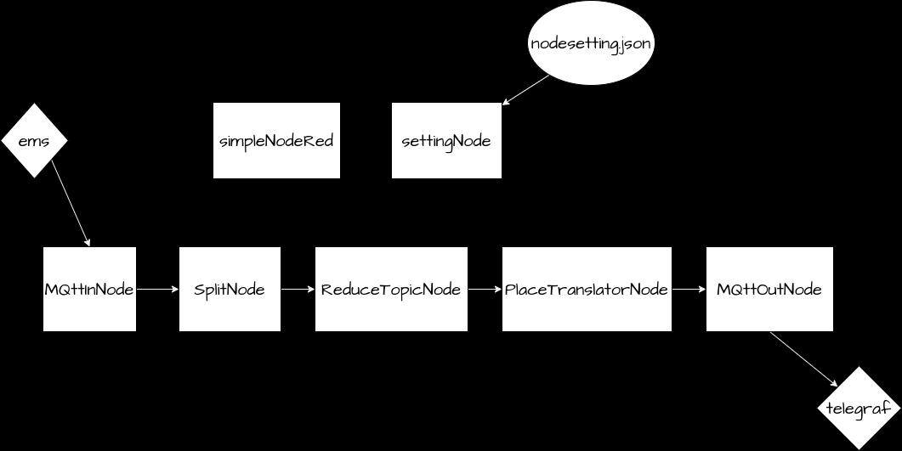

### mini-project-aiot-gateway-1

# 클래스 구조도

# 클래스 역할

## Exception
### AlreadyExistsException
  - 
 
### AlreadyStartedException
  -
  
### InvalidArgumentException
  - 
  
### OutOfBoundsException
  - 
  
## gateway
### SettingNode.java
  - 
  
### SimpleNodeRed.java
  -
  
## message
### JsonMessage.java
  - JsonObject를 담을 수 있는 메시지 객체
  
### Message.java
  - 노드들 간의 정보를 보내줄 때 메시지를 역할하는 추상클래스
  - 메시지를 생성할 때 고유의 id와 메시지 갯수를 증가하며 생성한다.
  - getId, getCreationTime(), getCount() 메서드가 있다.
  
## node
### MqttInNode.java (InputNode)
  - ems 서버에서 모든 토픽("#")을 받아오는 역할을 하는 클래스
  - connectServer() 메서드에서 ems 서버와 연결한다.
  - serverSubscribe() 메서드에서 새로운 JSONObject를 생성한 후 "#" 필터로 받아 온 topic과 payload를 추가한다.
  
### SplitNode.java (InOutputNode)
  -
  
### ReduceTopicNode.java (InOutputNode)
  -
  
### PlaceTranslatorNode.java (InOutputNode)
  -
  
### ReduceTopicNode.java (InOutputNode)
  -
  
### MqttOutNode.java (OutputNode)
  -
  
## setting
### nodeSetting.json
  - 각각의 노드들의 정보 (id, type, wire(다음을 노드의 주소))
  - 필터링 하고 싶은 topic과 sensors
  
## wire
### BufferedWire.java
  - Wire 인터페이스를 구현한다.
  - Message 큐가 필드로 존재한다.
  - Message에 대한 put, get, hasMessage메서드가 있다.
  
### Wire.java
  - Wire의 인터페이스
  
